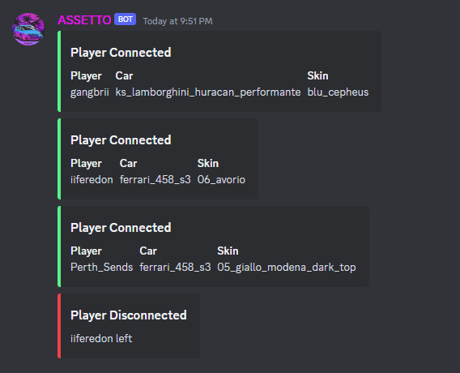
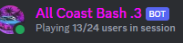
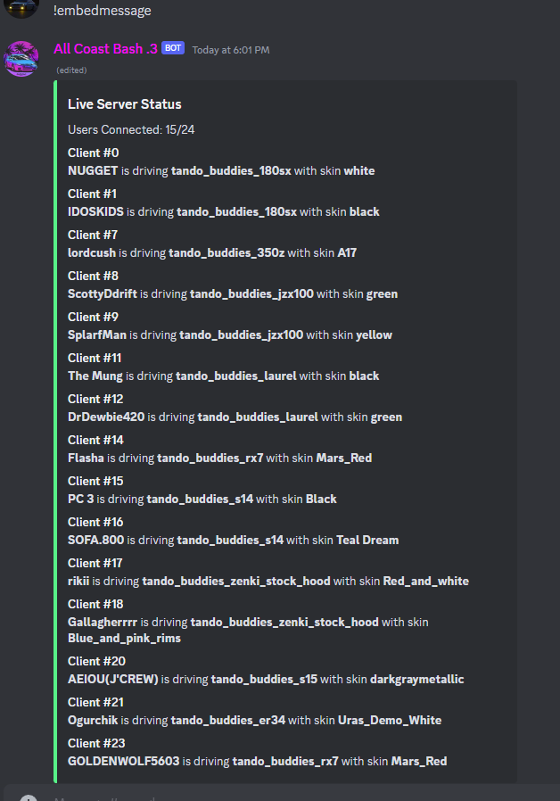
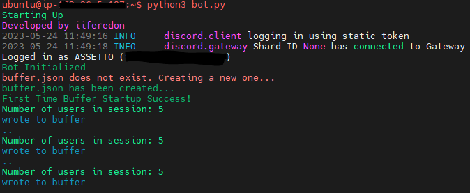

# Assetto-Corsa-Bot
<h3 align="center">Logs join and leave requests in a server via JSON dumping.</h3>

  <p align="center">
    
    <br />
  
    <br />
    <br />
  </p>
</div>


<!-- TABLE OF CONTENTS -->
<details>
  <summary>Table of Contents</summary>
  <ol>
    <li>
      <a href="#about-the-project">About The Project</a>
      <ul>
        <li><a href="#built-with">Built With</a></li>
      </ul>
    </li>
    <li>
      <a href="#getting-started">Getting Started</a>
      <ul>
        <li><a href="#installation">Installation</a></li>
      </ul>
    </li>
    <li><a href="#usage">Usage</a></li>
    <li><a href="#contact">Contact</a></li>
  </ol>
</details>


<!-- GETTING STARTED -->
## Update

```sh
- Added commands
- Added Live Server Status Embed (due to discord embed char limits, can only display upto 25 users at once)
- Small improvements ig
- Config file
```
<!-- ABOUT THE PROJECT -->
## About The Project

Monitor any Assetto Corsa server to check if a player has joined or left the server externally.
Tested on:
- Windows 10
- Ubuntu
- You can either run it from your desktop with python or run it in a linux vps
<p align="center">
    
  
  </p>

<p align="right">(<a href="#top">back to top</a>)</p>


### Built With

* [Discord.py](https://discordpy.readthedocs.io/en/stable/api.html)

<p align="right">(<a href="#top">back to top</a>)</p>


<!-- GETTING STARTED -->
## Getting Started

```sh
git clone https://github.com/iiferedon/Assetto-Corsa-Bot.git
cd Assetto-Corsa-Bot/
sudo apt-get update
sudo apt install python3-pip
pip install -r requirements.txt

```

### Installation

1. Create bot
  ```sh
  Fairly obvious just look this up, make sure PRESENCE INTENT, SERVER MEMBERS INTENT, MESSAGE CONTENT INTENT are all checked in the bot section. 
  Create the URL as admin because why not.
  ```
2. edit these in cfg file
   ```py
    [Discord]
    ;Discord Bot Token
    token =  

    ;Discord Server ID
    guild_id = 0000000000000000 

    ;Channel ID to send the connect and disconnect notifications to
    channel_id_leave_join = 00000000000000000 

    ;Channel to write the embed for current players on the server
    channel_for_embed_player_info = 000000000000000 

    [Server]
    ;Assetto Corsa Server IP
    address = 00.00.00.00

    ;Assetto Corsa Server Port
    port = 0000 

    [Other]
    ;Leave at 0, controls current embeded message id
    embed_id = 0 
   ```
   
<p align="right">(<a href="#top">back to top</a>)</p>


<!-- USAGE EXAMPLES -->
## Usage
```sh
#Start Script
python3 bot.py
```

## Commands
```sh
!embedmessage <creates a message to show the live server status with all players connected, also saves the message ID>
!deleteembed <deletes the message and the saved message ID. Use this to get rid of the embed dont delete it manually>
!pingserver <latency between the game server and the bots host>
!ping <latency in discord API to bot host>
```
<p align="center">
    
  </p>


<p align="right">(<a href="#top">back to top</a>)</p>


<!-- CONTACT -->
## Contact
Discord - iiferedon#7619 or iiferedon#1337


<p align="right">(<a href="#top">back to top</a>)</p>
